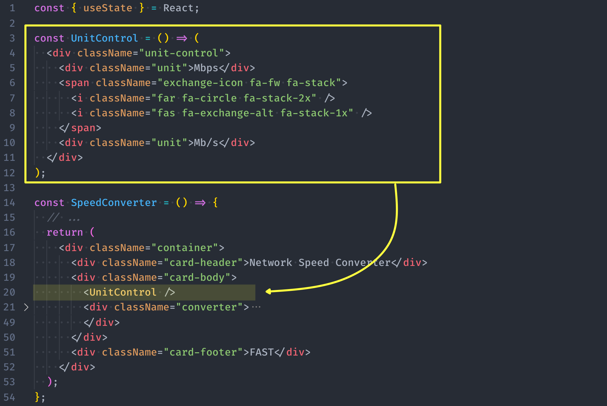

# 組件語法與useState/useEffect


## React component (組件)語法 <a href="#react-component-e7-b5-84-e4-bb-b6-e8-aa-9e-e6-b3-95" id="react-component-e7-b5-84-e4-bb-b6-e8-aa-9e-e6-b3-95"></a>

* component 就像是 JavaScript 的 function
* ReactDOM.render 中{函式名稱}變成了<函式名稱/> see:[Render Element](https://zh-hant.reactjs.org/docs/rendering-elements.html)
* <mark style="color:red;">Component 命名首字必須大寫，大寫駝峰的方式，否則 React 會把它當作一般的 HTML 元素處理</mark>，並跳出Warning提示，看到大寫駝峰命名變數時，可以知道是 React 組件而非一般函式。
* 其他 HTML 屬性、CSS 樣式屬性或一般的函式來說，則會遵行 JavaScript 以小寫駝峰來命名變數的慣例，例如在 className、maxLength、backgroundColor 等等。

```diff
import ReactDOM from "react-dom";

const App = 函式; 

//JSX縮寫 直接用()
- // const App = () => (
- //     <div>256</div>
- // );
//JSX有變數時 改() => {}
+const App = () => {
+  const count = 256;
+  return (
+      <div>{count}</div>
  );
+};
ReactDOM.render(<App />, document.getElementById("root"));
```

### props 是什麼 <a href="#props-e6-98-af-e4-bb-80-e9-ba-bc" id="props-e6-98-af-e4-bb-80-e9-ba-bc"></a>

* component 就像是 JavaScript 的 function，它接收任意的參數（稱之為「props」）[^1]並且回傳畫面的 React element。
* props 通常是不可變的(唯獨Immutable)，不能修改自己的
* props 為子組件接受父組件的溝通管道，是唯獨的不可異動

Ref:\[Components 與 Props] ([https://zh-hant.reactjs.org/docs/components-and-props.html](https://zh-hant.reactjs.org/docs/components-and-props.html))

###

### **function component **<mark style="background-color:orange;">**\[推薦寫法]**</mark>** vs class component**

接著看看兩種寫法轉換 Function 成 Class ：

**使用 function 來做 component**&#x20;

* 如果需要向component傳参数，可以使用 props 對象，
* 用 return (`html`)

```
function HelloName(props) {
	return <h1>Hello {props.name}!</h1>;
}
ReactDOM.render(
 <React.StrictMode>
	 <HelloName name="May"/>
	</React.StrictMode>,
	document.getElementById('example')
);
```

**使用ES6 class來做 component**

* 也可以使用ES6 class 來 來定義
* 繼承React.Component且在用render(){}包一層
* props 要改用 this.props
* 用render(){return html}

```
class HelloName extends React.Component {
  render() {
    return <h1>Hello, {this.props.name}</h1>;
  }
}

ReactDOM.render(
 <React.StrictMode>
	<HelloName name="May" />;,
	</React.StrictMode>,
	document.getElementById('example')
);
```

組件裡面可以再包組件，透過這樣可以重新利用\
範例練習: [USER info](https://codesandbox.io/s/usercard-vh0e4)

### **React組件 **<mark style="background-color:orange;">**ES6箭頭函式組件**</mark>** 寫法**

接著看看`箭頭函式語法`可以簡潔,少打很多字元

* const App= () => JSX.Element //大寫駱駝命名
* <mark style="background-color:orange;">縮寫：如果裡面只有return 可以去掉{}與return</mark>，但通常會有一些變數存在，個人習慣保留．
* 箭頭函式不可以使用於建構式，可以見[\[JS 01\] javascript 新手上路與概念筆記](https://minilabmemo.github.io/2021/02/20/js-start-01/)
* 使用插件快速鍵 rafc - ReactArrowFunctionComponent\


```
const Hello = () => {
  return ( <div>hello</div> )
}
```

***

## State的用法 <a href="#state-e7-9a-84-e7-94-a8-e6-b3-95" id="state-e7-9a-84-e7-94-a8-e6-b3-95"></a>

<mark style="color:red;">Props 是唯讀的(Immutable)，State 類似於 prop，但它是私有且由 component 完全控制的。當state被改變時，會進入re-render的update程序，更新畫面</mark>

* state 為自身component 存放資料的地方，管理內部狀態

### **class(setState) vs **<mark style="background-color:orange;">**function(useState) \[推薦寫法]**</mark>&#x20;

**1. 使用class來改state（setState）**

* 使用 ES6 class來 來定義
* 繼承React.Component且在用render(){}包一層
* props 要改用 this.props
* 如果想要更改props ，要改用setState
* [根據React 與 bind this](https://medium.com/reactmaker/react-%E8%88%87-bind-this-%E7%9A%84%E4%B8%80%E4%BA%9B%E5%BF%83%E5%BE%97-323c8d3d395d)
* 範例練習:透過一個新的按鈕去改變時間 [Refresh Time](https://codesandbox.io/s/refreshtime-ju4pv?file=/src/index.js)

<pre class="language-jsx" data-overflow="wrap"><code class="lang-jsx"><strong>import React from "react";
</strong>import ReactDOM from "react-dom";

import App from "./App";

const rootElement = document.getElementById("root");

class Clock extends React.Component {
  constructor(props) {
    super(props);
    this.state = { date: new Date() };
    // this.changeTime=this.changeTime.bind(this);
  }

  // changeTime(){
  //   this.setState({date: new Date()})
  // }
  //根據React 與 bind this

  //以上可以簡化 改箭頭含式寫法
  changeTime = () => {
    this.setState({ date: new Date() });
  };

  render() {
    return (
      &#x3C;div>
        &#x3C;h1>Hello, world!&#x3C;/h1>
        &#x3C;h2>现在是 {this.state.date.toLocaleTimeString()}.&#x3C;/h2>
        &#x3C;button onClick={this.changeTime}>刷新 &#x3C;/button>
      &#x3C;/div>
    );
  }
}

ReactDOM.render(
  &#x3C;React.StrictMode>
    &#x3C;Clock />,
  &#x3C;/React.StrictMode>,
  rootElement
);


</code></pre>

### **2.使用function component更改state（用useState）**

* 沒有內部狀態（State），是 Stateless Components。
* 沒有 Lifecycle Hooks 和 refs。
* 如果想要更改props 要改用useState，useState-是一個基礎的Hook，是可以在function component中使用設定state，而不需要轉換成class。

> hook意思是“鈎子”，在音樂上，指的是一首歌曲中最能鈎人的部分。Hook 是 React 16.8 增加的新功能。讓你不必寫 class 就能使用 state 以及其他 React 的功能。使用hook可以更簡化且被推崇使用。

* <mark style="color:red;">useState它回傳了一對值：目前的 state 跟一個可以更新 state 的 function。useState 其實是React 物件中的一個方法，用法的兩個參數其實是解構賦植的用法</mark>
* 範例改寫練習 [Refresh\_Time\_useState](https://codesandbox.io/s/refreshtimeusestate-xns3c?file=/src/index.js)

<pre class="language-diff"><code class="lang-diff"><strong>+//1.加上useState引入
</strong>+import React, { useState } from 'react';
import ReactDOM from "react-dom";

const Clock=()=>{
+// 2.宣告一個 state 變數，命名date。 傳入 useState() 的參數就是 state 起始值
+  const [date, changeTime] = useState(new Date());

+// 3-1 return中直接寫上state變數-在 function 中可以直接使用 state
  return(
      &#x3C;div>
        &#x3C;h1>Hello, world!&#x3C;/h1>
+       &#x3C;h2>现在是 {date.toLocaleTimeString()}.&#x3C;/h2>

// 3-2 當使用者點擊，我們就呼叫 函式 並傳入新的值。
+        &#x3C;button onClick={()=>{changeTime(new Date())}}>刷新 &#x3C;/button>
      &#x3C;/div>
  );
}

const rootElement = document.getElementById("root");
ReactDOM.render(
  &#x3C;React.StrictMode>
    &#x3C;Clock/>
  &#x3C;/React.StrictMode>,
  rootElement
);

</code></pre>

***

**（延伸說明）hooks 與 Function Component**

[使用 State Hook](https://zh-hant.reactjs.org/docs/hooks-state.html)

* 用 Function Component 代替 Stateless Component 的说法，原因是：自从 Hooks 出现，函数式组件功能在不断丰富，函数式组件不再需要强调其无状态特性，因此叫 Function Component 更为恰当。
* 從[精读《Function VS Class 组件》](https://zhuanlan.zhihu.com/p/59558396)\
  中可以看的使用class component,會因為使用this問題而需要修復，要follow class結構與巢狀太過雜亂，再者，而function component沒有this,如果希望拿到稳定的 props，使用 Function Component 是更好的選擇。而
* Function Component + Hooks 可以实现 Class Component 做不到的 capture props、capture value，而且 `React 官方也推荐 新的代码使用 Hooks 编写`。
* **不能在條件式（conditions）、迴圈（loops）或嵌套函式（nested functions）中呼叫 Hook 方法**

```diff
錯誤使用
- if (isValidCounter <= 10) {
    const [count, setCount] = useState();
-f  }
```


之所以會有這樣的規定是因 React 組件（例如，`<Counter />`）每次在渲染或更新畫面時，都會呼叫產生這個組件的函式（`Counter()`），而**在 React Hooks 中會去記錄這些 Hooks 在函式中被呼叫的順序，以確保資料能夠被相互對應**，但若當我們將 Hooks 放到條件式或迴圈時，就會破壞了這些 Hooks 被呼叫到的順序，如此會造成錯誤。

from \[Day 11 - 網速轉換器] 那個...資料可以分享給我嗎 - 將資料傳入組件


***

## 生命週期 <a href="#e7-94-9f-e5-91-bd-e9-80-b1-e6-9c-9f" id="e7-94-9f-e5-91-bd-e9-80-b1-e6-9c-9f"></a>

元件被安裝時(Mount)、元件被更新時(Update)、元件被移除時(Unmount)\
\*註：原本想要一樣比較一下class 原本的用法，但還是直接介紹function component(useEffect)更簡潔．

### **useEffect hook**

```
useEffect(() => {
    /*  componentDidMount 和  componentDidUpdate */
    return () => {
      /* componentWillUnmount */   //在 component unmount 時，React 會執行清除。
    };
    
}, [dependencies參數]); /* 是用來限定當哪些變數被改變時useEffect要觸發 */

```

Ref:

* [官方-hooks-effect](https://zh-hant.reactjs.org/docs/hooks-effect.html) 重點：
  * 內有使用class與hook 的範例對比說明
  * 很多待細讀 ＴＢＤ
  * 我們建議使用 exhaustive-deps 規則作為我們 eslint-plugin-react-hooks package 的一部分。當不正確地指定依賴時，它會發出警告，並提出修改建議。

***

## 組件拆分

設計思考：拆分成獨立的元件外，現在，我們要根據使用者輸入的值不同來呈現不同的畫面

> 備註 做拆分後有出現devTools讀不到檔案出現異常 這時重開就可以了

### 範例：同檔案拆分

<figure><figcaption></figcaption></figure>

#### 範例：props的傳遞 與解構賦值

* \`使用 \<div>  {element}\</div>\`
* props 傳遞以下所見

```diff
定義 const element = <ChildComponent firstName="Aaron" lastName="Chen" />;

// funtion定義 
- function ChildComponent(props) { //直接用props.
-   return <h1>Hello, {props.firstName} {props.lastName}</h1>;    // Hello, Aaron Chen
- }

 
 function ChildComponent(props) {
+   const { firstName, lastName } = props; // 透過解構賦值把 props 內需要用到的變數取出
+   return <h1>Hello, {firstName} {lastName}</h1>;    // Hello, Aaron Chen
 }

 //更精簡到連 props 都不命名了: 透過解構賦值直接在「函式參數的地方」把需要用到的變數取出
+ function ChildComponent({ firstName, lastName }) {
+   return <h1>Hello, {firstName} {lastName}</h1>;    // Hello, Aaron Chen
 }
 
 
 //寫法對照------------
 
 <Counter startingValue={3} />
 
 //箭頭定義
 const Counter = (props) => {
  // STEP 3: 使用解構賦值把 startingValue 從 props 中取出
  const { startingValue } = props;
    ...
  return (
   {/* ... */}
  );
};
 
```


參考[\[Day 10 - 網速換算器\] 換算起來吧 - 資料綁定與組件拆分](https://ithelp.ithome.com.tw/articles/10221113) \
[\[Day 11 - 網速轉換器\] 那個...資料可以分享給我嗎 - 將資料傳入組件](https://ithelp.ithome.com.tw/articles/10221577)


### 範例：分檔案拆分 <a href="#e7-b6-b2-e8-b7-af-e5-8f-83-e8-80-83-e7-af-84-e4-be-8b" id="e7-b6-b2-e8-b7-af-e5-8f-83-e8-80-83-e7-af-84-e4-be-8b"></a>

```jsx
// 新增./src/WeatherCard.js 或jsx （看專案格式）
import React from 'react';
const WeatherCard = () => {
  return (
    <WeatherCardWrapper> //原本叫<WeatherCard> 避免衝突改掉
      {/* 放入原本在父層的東西 */}
    </WeatherCardWrapper>
  )
}
export default WeatherCard;

// 父層
//import WeatherCard from './WeatherCard';
import WeatherCard from './WeatherCard.jsx'; （看專案格式）
const WeatherApp = () => {
  return (
    <ThemeProvider theme={theme[currentTheme]}>
      <Container>
        <WeatherCard />
      </Container>
    </ThemeProvider>
  );
};
```

### 範例：分檔案拆分：儲存變數

```javascript
// ./src/utils.js
export const availableLocations = [
  // ...
];

export const findLocation = (cityName) => {
  return availableLocations.find(location => location.cityName === cityName);
};


// 匯入 availableLocations
import { availableLocations } from './utils';
import { findLocation } from './utils';

```

### 範例：自己造cusomer hook

* 把要給其他 React 組件使用的資料或方法回傳出去
* 下面範例跟前述不同不是回傳`<div>  {element}</div>`

```diff
+ // ====新增useWeatherApi.js====
const useWeatherApi = () => {
  // STEP 5：把要給其他 React 組件使用的資料或方法回傳出去
+ import {useState, useEffect, useCallback} from 'react';
+ 注意這邊可以搬入所有相關 useState, useEffect, useCallback程式碼
useEffect(() => {
    fetchData();
  }, [fetchData]); //放入函示，該函式需注意要用useCallback

  const [weatherElement, setWeatherElement] = useState({

+ return [weatherElement, fetchData];
};
export default useWeatherApi;


+//===套用方接走資料====
+import useWeatherApi from './useWeatherApi';
// ...
const WeatherApp = () => {
  // STEP 2：使用 useWeatherApi Hook 後就能取得 weatherElement 和 fetchData 這兩個方法
+  const [weatherElement, fetchData] = useWeatherApi();

```


## 網路參考範例: <a href="#e7-b6-b2-e8-b7-af-e5-8f-83-e8-80-83-e7-af-84-e4-be-8b" id="e7-b6-b2-e8-b7-af-e5-8f-83-e8-80-83-e7-af-84-e4-be-8b"></a>

[React State(状态)](https://www.runoob.com/react/react-state.html) @runoob基礎與線上範例\
[State 和生命週期](https://zh-hant.reactjs.org/docs/state-and-lifecycle.html) @React中文React解說\
[【React.js入門 - 11】 開始進入class component](https://ithelp.ithome.com.tw/articles/10219057) @IT邦幫忙的系列文\
[React 與 bind this ](https://medium.com/reactmaker/react-%E8%88%87-bind-this-%E7%9A%84%E4%B8%80%E4%BA%9B%E5%BF%83%E5%BE%97-323c8d3d395d)@medium

[React hook](https://zh-hant.reactjs.org/docs/hooks-intro.html) @React 中文解說Hook系列\
[使用 State Hook](https://zh-hant.reactjs.org/docs/hooks-state.html) @React 中文解說State Hook中寫法對比

[\[Day 25 - 即時天氣\] 自己的鉤子自己做 - 建立 Custom Hook](https://ithelp.ithome.com.tw/articles/10227282)

[^1]: 
