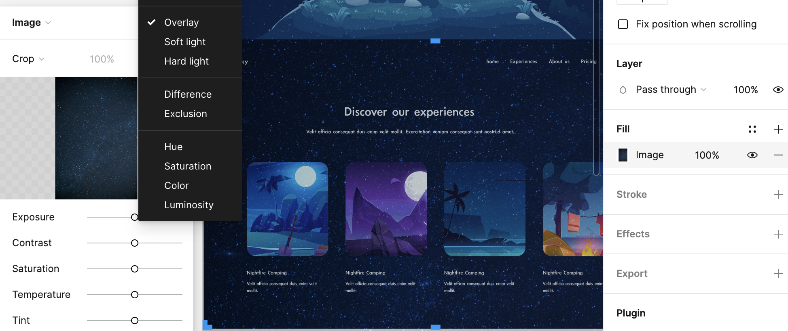

# 操作

### Figma 怎么切图？4种方法详解

[Figma 怎么切图？4种方法详解](https://js.design/special/article/figma-how-to-cut.html)

### 物體間距離

將光標懸停在其他對像上時按住 alt 或 option 鍵 Figma 將顯示到其它對象邊緣的距離。

#### autoLayout

如果希望控制距離的數字，把物件變成frame（點選autolayout就會變），然後就可以調整數字了。

.png>)

### 播放

按鍵盤Ｒ可以重新播放

可以在原型裡加上flow名稱，播放側邊欄就會有flow可以選擇

### 兩張頁面同元素動畫

使用上要把同元素命名一樣，不然智能動畫會不知道是同一個

畫面動畫設定 打開原型，延遲一秒表示圖片會停一秒，然後填入效果，第一張拉一條到第二張

第一張元素甚至位置往下移一點，第二張位置中間，動畫就會有向上移動的感覺．\


複製元素時，貼上某一個“Frame中”元素再點擊Frame然後貼上就會在同一位置了，第一張元素穿透改成Pass Through0%，到了第二張就可以漸漸顯示了．


### 三角形去掉一邊

拉一個圖形，描邊stroke，把填充去掉，雙擊某一**邊**，鍵盤下Ｘ，就可以刪掉一邊了．


影片教學 [Figma: How to cut a segment of a line, stroke or shape](https://www.youtube.com/watch?v=Jxmg7q82Xac)


#### clip content


超出frame的地方可以勾選裁切內容clip content，讓它顯示


圖片裁切

點選圖片後第二個選項框選擇crop 就可以裁切了



#### 圖片融合 overlay

有星星效果的背景與原本背景的融合設定

